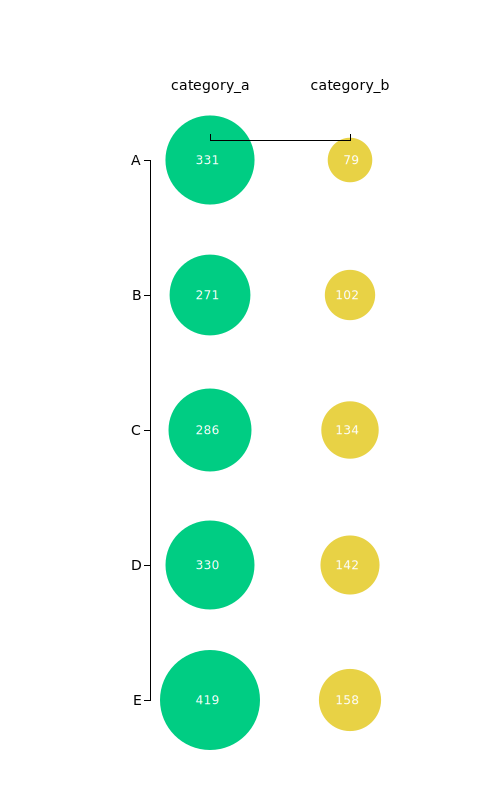

# How to make a bubble diagram with d3.js?

This is some dummy-code with dummy-data to produce a bubble chart that looks like this:

## What is this good for?
- As a base template to produce proof of concept visuals in this format (and then export it e.g. via the NYTimes' [SVG Crowbar](https://nytimes.github.io/svg-crowbar/)) to then adapt it to the desired design with help of software like Adobe Illustrator

- As a rough starting point to turn it into an full-fledged interactive chart

## Options

**Dimensionality**: This visual allows you to plot 3 to 4 dimensions in your data: x- and y-position, circle size, color category. The dummy chart only uses three of the four dimensions, as the x-position and color category are identical.

**Use cases**: I usually use bubble charts when the distance between the smallest and biggest datapoint is too big to show them with a bar chart. It also turns out more nicely if there's a lot of variablity in the data.

**Scales**: Both scales in this example are categorical, which can of course be changed according to your needs. 

**Categories**: In addition to the categorical x-scale, you can also color-code with this category; you can of course also use a different variable to color-code the bubbles.

## Data structure

| Column 1: y-variable    			   | Column 2: category (x-variable, color)    			  | Column 3: datapoint		     |
|--------------------------|--------------------------|--------------------------|
| This is where your different y-variables go,if you have more than one data point associated with one y-variable, enter each of them as a separate row | This is where the category your classes go that you want to use to disperse along the x-axis and maybe also color-code |  This is where the actual datapoint goes that is associated with a certain y-variable & x-variable combination |

## Real-life example (no dummy data)
This repo contains only a dummy example. If you want to see an example with actual data, please check out [this example](https://github.com/dw-data/quantify-europe_asylum-seekers/blob/master/d3-files_asylum/rearrangeddatascript.js).

## Usage & questions
Feel free to use this code, any form of credit much appreciated, but not mandatory. If you have questions, feel free to get in touch via gcgruen[at]gmail[dot]com